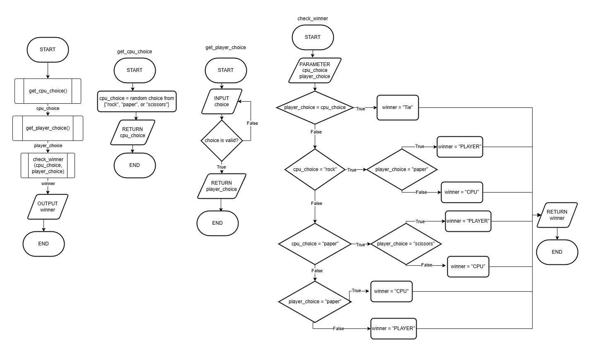

# Activity 5: Rock, Paper, Scissors

In this activity, we will walk through how to create a game of rock, paper, scissors using functions!

When you have completed the guided part of this activity, be sure to also complete the [Extension Activity](#extension-activity-rock-paper-scissors-tournament)

## 1. Create a Root Folder

Whenever you are creating a new Python project, it is best to stay organized by placing all the files related to the project in the same folder. Create a folder named `root`.

Inside the folder, create a new `main.py` file.

## 2. Program Flowchart

Below is a flowchart to help organize your program visually!



Note that this flowchart includes 3 sub process as functions!

## 3. Program Pseudocode

Below is some pseudocode that outlines the program structure of your program.

```txt
PROGRAM START

FUNCTION get_cpu_choice():
    cpu_choice = randome choice from "rock, paper, and scissors"
    RETURN cpu_choice
END FUNCTION

FUNCTION get_player_choice():
    WHILE True:
        INPUT player_choice
            IF player_choice is valid THEN:
                RETURN player_choice
            END IF
    END WHILE
END FUNCTION

FUNCTION check_winner(cpu_choice, player_choice):
    IF player_choice == cpu_choice THEN:
        winner = "Tie"
    ELSE IF cpu_choice == "rock" THEN:
        IF player_choice == "paper" THEN:
            winner = "PLAYER"
        ELSE:
            winner = "CPU"
        END IF
    ELSE IF cpu_choice == "paper" THEN:
        IF player_choice == "scissors" THEN:
            winner = "PLAYER"
        ELSE:
            winner = "CPU"
        END IF
    ELSE IF player_choice == "paper" THEN:
        winner = "CPU"
    ELSE:
        winner = "PLAYER"
    END IF
    RETURN winner
END FUNCTION

cpu_choice = get_cpu_choice()

player_choice = get_player_choice()

winner = check_winner(cpu_choice, player_choice)

OUTPUT winner

PROGRAM END
```

## 4. Implement the Program

With a structure outlined, it's time to turn our pseudocode into code!

While our Pseudocode mostly looks like regular Python, there are some specific tweaks than you'll need to make, especially when it comes to random values.

Python has a library called "random" that can be imported at the top of your program with the following code:

```python
import random
```

Some key uses for random are generating a random number between 0 and 1:

```python
# Random float between 0 and 1
value = random.random()
```

A random integer in an inclusive range (meaning the random number can be either the highest or lowest number):

```python
# Random integer where 1 <= integer <= 10
value = random.randint(1, 10)
```

A random value from a list:
```python
# Random choice between "Left" or "Right"
value = random.choice(["Left", "Right"])

# Another valid syntax for random choice
choices = ["Left", "Right"]
value = random.choice(choices)
```

Using Python syntax, create the program and test it. Does it work? What if the user inputs random text, like "hello?".

# Extension Activity: Rock, Paper, Scissors Tournament

Extend your Rock, Paper, Scissors program so that it plays multiple rounds and keeps track of the results. You will be creating a system that tracks a best of 5 tournament (first to 3 wins).

### Requirements

* Allow the player to play **multiple rounds** of Rock, Paper, Scissors.
* Keep track of the **player's wins, CPU's wins, and ties** using separate variables.
* Create a new `play_round()` function that uses your existing functions to play **one complete round** and returns the winner.
* Continue playing until either the player or CPU reaches **3 wins**.
* After every round, display the **current score**, and when the tournament ends, display the **overall winner**.
